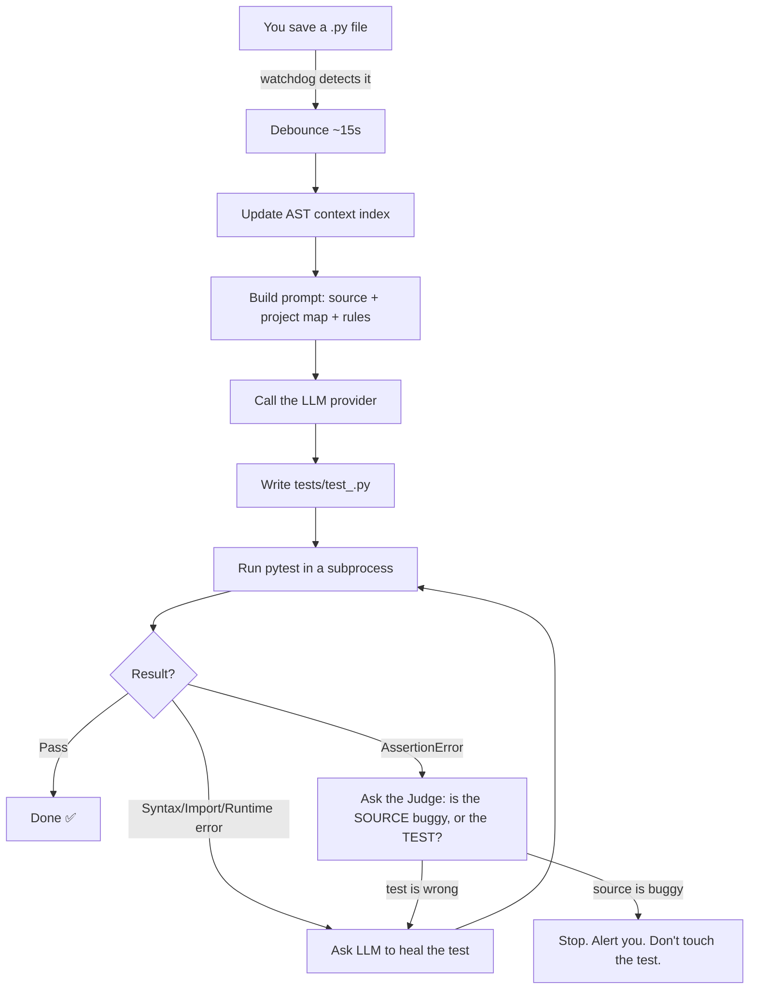

# Ghost, Explained

This document walks through **what Ghost does, how it's built, and how the pieces
fit together** — written for someone comfortable with Python and basic CS
concepts (AST, threads, subprocesses) but seeing this codebase for the first
time.

---

## 1. The one-sentence pitch

Ghost is a **CLI tool that watches your Python files, and every time you save
one, automatically writes a `pytest` test file for it using an LLM, runs the
test, and — if the test is broken — asks the LLM to fix it.**

Think of it as a very persistent QA intern sitting next to you, hitting "run
tests" after every save, and fixing typos in the test file when they break.

---

## 2. Why this is a genuinely interesting problem

Naively, "call an LLM to write a test" is a one-line ChatGPT prompt. The hard
parts Ghost solves are:

1. **Context** — an LLM can't write `from app.utils import parse` correctly
   unless it knows `utils.py` exists and has a `parse` function. Ghost solves
   this with a lightweight **AST-based project index** (`ghost/init.py`).
2. **Reliability** — LLMs sometimes generate code with a typo, a bad import, or
   markdown fences around the code. Ghost **runs the generated test in a real
   subprocess** and classifies the failure so it can react correctly.
3. **Not cheating** — the sneaky failure mode of "AI writes your tests" is that
   when a test fails, a lazy system just rewrites the test to match whatever
   the code does — even if the code is buggy. Ghost's **"Judge" step**
   explicitly guards against this.
4. **Rate limits & flakiness** — free LLM APIs (like Groq's free tier) throttle
   you hard. Ghost has its own rate limiter + exponential-backoff retry logic.
5. **Being a good background citizen** — a file watcher that fires an API call
   on every keystroke would be unusable. Ghost **debounces** file events.

None of this is exotic computer science, but it's exactly the kind of "glue
engineering" that separates a demo from a tool you'd actually run all day.

---

## 3. The high-level flow



The loop in the middle (`generate → run → classify → heal → run again`) repeats
up to `max_heal_attempts` times (default 3) before Ghost gives up and leaves
you a log message.

---

## 4. Project layout

```
ghost/
├── cli.py           # Click-based CLI: `ghost init/start/stop/status/...`
├── main.py          # Legacy single-process watch loop (used by `ghost watch`)
├── daemon.py        # Background daemon version of the watcher (used by `ghost start`)
├── init.py          # AST scanner: builds .ghost/context.json (the "project map")
├── chat.py          # Builds LLM prompts, calls the provider, cleans the response
├── providers.py     # Adapter layer for Groq / OpenAI / Anthropic / Ollama / etc.
├── config.py        # Loads ghost.toml + .env + env-var overrides into a dataclass
├── job_queue.py      # Debouncing + single-worker FIFO queue for file events
├── rate_limiter.py  # Global "don't call the API too fast" + retry-with-backoff
├── runner.py        # Runs `pytest` as a subprocess, classifies the failure type
└── console.py       # All the pretty terminal output (colors, spinners, banners)
tests/               # pytest suite for Ghost itself (79 tests, all passing)
```

A useful mental model: **`init.py` builds the "brain" (the project map),
`chat.py` + `providers.py` talk to the AI, `runner.py` + `job_queue.py` handle
process/thread plumbing, and `cli.py`/`daemon.py` wire it all into commands.**

---

## 5. Walking through each module

### 5.1 `config.py` — configuration

Ghost is configured by a `ghost.toml` file at your project root (created by
`ghost init`), optionally overridden by a `.env` file or real environment
variables (`GROQ_API_KEY`, `OPENAI_API_KEY`, etc.). It's parsed into a
`GhostConfig` dataclass with nested sections: `ai`, `scanner`, `tests`,
`watcher`. This is a standard "layered config" pattern: **defaults → file →
environment**, each layer overriding the previous.

```toml
[ai]
provider = "groq"
model = "llama-3.3-70b-versatile"
rate_limit_rpm = 30

[tests]
auto_heal = true       # let Ghost try to fix broken tests
max_heal_attempts = 3  # give up after 3 tries (avoid infinite loops)
use_judge = true        # enable the "is this a real bug?" check
```

### 5.2 `init.py` — the project map

This is the most "computer-sciency" file. `ghost init` walks your project
directory and, for every `.py` file, parses it with Python's built-in `ast`
module (no LLM call needed — this is pure static analysis) to extract:

- top-level function names + their argument lists
- class names + their method names

It attaches a `.parent` pointer to every AST node (`add_parent_links`) so it
can tell a *top-level* function apart from a method nested in a class — the
standard trick since `ast` doesn't track parents by default.

The result is written to `.ghost/context.json`, e.g.:

```json
{
  "utils.py": "Functions: parse(text), clean(s); Classes: None",
  "models.py": "Functions: None; Classes: User [Methods: __init__, save]"
}
```

This file is later injected into every LLM prompt so the model knows what's
importable — it's a cheap, deterministic substitute for giving the LLM a full
RAG pipeline over your codebase.

When you edit or delete a file, `walk_and_modify_json` / `walk_and_delete_json`
patch just that one entry instead of re-scanning the whole project — an
incremental-update optimization.

### 5.3 `providers.py` — talking to different LLMs

Defines a `BaseProvider` abstract class with one method, `chat(messages, model,
temperature)`, and concrete subclasses for Groq, OpenAI, Anthropic, Ollama,
OpenRouter, LM Studio, and generic OpenAI-compatible endpoints. This is the
classic **Strategy pattern** — `chat.py` doesn't know or care which provider
it's talking to; `get_provider(name)` just returns the right implementation.
This is *why* switching from Groq to a local Ollama model is a one-line config
change.

### 5.4 `chat.py` — prompt engineering + response cleanup

`TestGenerator` has three prompt-building methods:

- `create_prompt` — "write a brand-new test file for this source file."
- `create_prompt_test` — "here's a test file with these specific errors, fix
  them" (used during self-healing).
- `consult_the_judge` — "here's the source, the test, and the failure; tell me
  in ONE WORD whether the bug is in the source or the test."

Every prompt hard-codes strict output rules ("output ONLY Python code, no
markdown, no explanations") because LLMs love to wrap code in ```` ```python ````
fences or add a friendly sentence before the code. `clean_llm_response` then
strips markdown fences with a regex as a safety net regardless.

Note the **temperature is fixed at 0.1** — low temperature means "be
deterministic / boring," which is exactly what you want for code generation
(you don't want creative test assertions).

### 5.5 `runner.py` — running tests and classifying failures

`run_test` shells out to `python -m pytest <test_file>` as a subprocess (not
calling pytest as a library) — this isolates the test run so a crash in the
generated test can't take down Ghost itself, and lets Ghost capture stdout,
stderr, and the exit code independently.

`classify_error` is a simple, deliberately crude keyword classifier:

| Signal in output | Classified as | Ghost's reaction |
|---|---|---|
| `IndentationError`, `ModuleNotFoundError`, `ImportError` | `SYNTAX` | auto-heal (call LLM to fix) |
| `AttributeError` | `RUNTIME` | auto-heal |
| `AssertionError` | `LOGIC` | ask the Judge |
| anything else | `UNKNOWN` | auto-heal (best effort) |

This is intentionally simple string-matching rather than parsing the traceback
structurally — a good example of "the simplest thing that could possibly
work," matching the project's philosophy of leaning on the LLM for anything
that needs actual understanding.

### 5.6 The "Judge" — the most interesting design decision

If a test fails with `AssertionError`, that could mean **two very different
things**:

- The test's expectation is wrong (test bug) → fix the test.
- The source code actually computes the wrong answer (real bug) → do **not**
  silently "fix" the test to match broken behavior; that would hide a real
  defect.

`consult_the_judge` sends both the source code and the failing test to the
LLM and asks it to output exactly `BUG_IN_CODE` or `FIX_TEST`. If it's a real
bug, Ghost stops and prints a loud warning instead of touching anything. This
is the project's main defense against the classic "AI writes tests that just
rubber-stamp whatever the code does" failure mode.

### 5.7 `job_queue.py` — debouncing file events

Editors don't save a file once — many editors/OSes fire several
create/modify/delete events per save (temp file, rename, write). Calling an
LLM on *every* raw event would be wasteful and slow. `TimerDebouncer` handles
this with a classic pattern: each file path gets its own `threading.Timer`;
every new event for that path **cancels and restarts** the timer. The LLM call
only actually fires once the file has been quiet for `debounce_seconds`
(default 15s).

`JobQueue` then sits on top of that: a single background worker thread pulls
debounced jobs off a `Queue` and processes them **one at a time, in order** —
this keeps things simple (no concurrent LLM calls stepping on the rate
limiter) and avoids two AI calls racing to write the same test file.

### 5.8 `rate_limiter.py` — being nice to (or surviving) the API

Two independent mechanisms:

- `RateLimiter` — a global, class-level "traffic cop": before every API call,
  it checks how long since the last call and sleeps if needed, so Ghost never
  exceeds the configured requests-per-minute.
- `call_with_retry` — a decorator that catches rate-limit-shaped errors (HTTP
  429, "rate limit", "quota exceeded", etc.) and retries with **exponential
  backoff + random jitter** (`base_delay * 2^attempt + random jitter`). The
  jitter matters: without it, if multiple processes get rate-limited at the
  same instant, they'd all retry at the same instant again (the "thundering
  herd" problem).

### 5.9 `daemon.py` vs `main.py` — two ways to run the watcher

- `main.py` (`ghost watch`) — runs in your terminal in the foreground; you see
  live spinners and colored output; Ctrl+C stops it.
- `daemon.py` (`ghost start` / `ghost stop` / `ghost status`) — forks a
  detached background process that survives closing the terminal. It:
  - writes its PID to `.ghost/pid` so `ghost stop` knows what to kill,
  - installs `SIGTERM`/`SIGINT` handlers that just set a `threading.Event`
    (the handler itself must be *async-signal-safe* — no logging, no
    allocation — a real-world OS signals gotcha worth knowing),
  - logs to a rotating log file (`.ghost/logs/ghost.log`, 10MB × 5 backups)
    instead of stdout, since nobody is watching the terminal,
  - redirects `sys.stdout`/`sys.stderr` to `/dev/null` to avoid noise from
    any library that prints unexpectedly.

This start/stop/status/logs daemon pattern is the same shape used by real
system services (think `nginx -s reload`, a PID file + signal handling).

### 5.10 `cli.py` — the user-facing commands

Built with [`click`](https://click.palletsprojects.com/). Commands:

| Command | What it does |
|---|---|
| `ghost init` | Creates `ghost.toml`, `.ghost/`, and the initial `context.json` |
| `ghost start` / `stop` / `status` / `logs` | Manage the background daemon |
| `ghost watch` | Foreground watcher (like `start` but blocking, with live output) |
| `ghost generate <file>` | One-shot: generate a test for a single file right now |
| `ghost config` | Interactive wizard to edit `ghost.toml` |
| `ghost providers` | Lists providers, shows which have API keys configured |
| `ghost doctor` | Health check: Python version, installed packages, config presence |

### 5.11 `console.py` — the UX layer

Purely cosmetic but worth knowing it's there: hand-rolled ANSI color codes,
spinner animations (`GhostSpinner`), and formatted status messages
(`Console.success`, `Console.error`, `Console.judging`, etc.). None of this
affects program logic — it's the presentation layer, kept deliberately
separate from the business logic in `main.py`/`chat.py`.

---

## 6. Running it yourself

The project is already set up in this environment: dependencies are installed
via `uv`, and `uv run pytest` passes all 79 tests.

```bash
# One-time setup already done for you:
uv sync --dev

# Try it on a scratch project:
mkdir /tmp/demo && cd /tmp/demo
uv run --project /home/bashar/Downloads/ghost-main ghost init
export GROQ_API_KEY=...          # or configure ollama instead
uv run --project /home/bashar/Downloads/ghost-main ghost watch
# now edit a .py file in /tmp/demo and watch Ghost generate a test for it
```

Or, once installed globally (`uv tool install ghosttest` / `pip install
ghosttest`), you'd just run `ghost init` / `ghost watch` directly inside any
Python project.

Run Ghost's own test suite:

```bash
uv run pytest -q
```

---

## 7. Things worth knowing if you extend this project

- **Test coverage of Ghost itself lives in `tests/`** — one test file per
  module (`test_runner.py`, `test_chat.py`, `test_config.py`, etc.), using
  `pytest` + fixtures in `conftest.py`. This is the "physician, heal thyself"
  irony worth appreciating: a tool that writes tests for other people's code
  is itself tested the traditional, human-written way.
- **The classifier in `runner.py` is intentionally naive.** If you wanted to
  extend Ghost, making failure classification structural (parsing the
  traceback) rather than substring-matching would be a natural improvement.
- **`main.py`'s `check_test` and `daemon.py`'s `_process_file` duplicate a lot
  of logic** (generate → run → classify → heal → judge). They evolved somewhat
  independently (foreground vs. background use case) — a good candidate for
  refactoring into one shared function if you work on this codebase further.
- **Everything hinges on the LLM obeying "output only code."** The
  `clean_llm_response` regex is the main safety net; less capable/local models
  (via Ollama) may need a stricter parser if they don't follow the fence
  convention.
